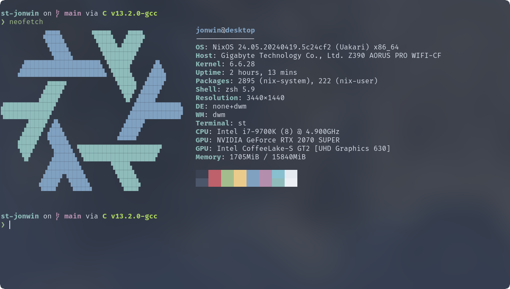

# St Jonwin

My st configuration with flake.nix

st is a simple terminal emulator for X which sucks less.

## Table of contents

- [Dependencies](#dependencies)
- [Installation](#installation)
    - [On most distros](#on-most-distros)
    - [NixOS](#nixos)
        - [Test](#test)
        - [Install](#install)
- [Installed patches](#installed-patches)
- [Keybindings](#keybindings)

## Dependencies

- Xlib header files.
- FiraCode Nerd Font
- harfbuzz

**Note:** On NixOS dependencies are automatically installed. (Not the font)

## Installation

### On most distros

Edit config.mk to match your local setup (st is installed into
the /usr/local namespace by default).

Afterwards enter the following command to build and install st (if
necessary as root):

    make clean install

### NixOS

#### Test

To test run this configuration an any system with nix run the following:

    nix run github:jonwin1/st-jonwin

#### Install

Add this repo as an input in your flake.nix:

    inputs = {
        st = {
            url = "github:jonwin1/st-jonwin";
            inputs.nixpkgs.follows = "nixpkgs";
        };
    };

Then add this to your configuration.nix to install st:

    environment = {
        systemPackages = with pkgs; [
            inputs.st.packages."${system}".default
        ];
    };

## Installed patches

- TODO

## Keybindings

- `alt + shift + k`: Zoom in
- `alt + shift + j`: Zoom out
- `alt + c`: Copy
- `alt + v`: Paste

## Credits

Based on Aurélien APTEL <aurelien dot aptel at gmail dot com> bt source code.

